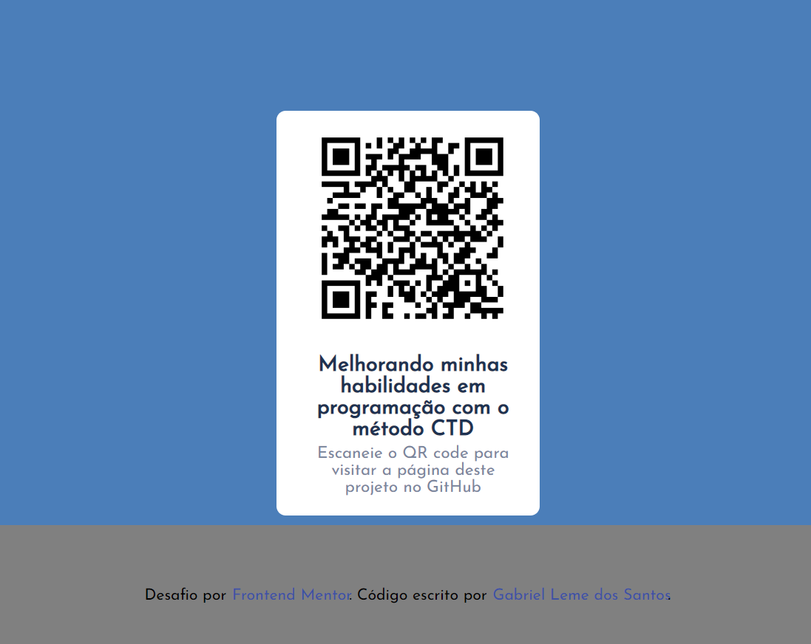

# Página QR Code

Essa é uma simples página contendo um QR Code, baseado no challenge do site Frontend Mentor, feito para praticar o CTD (Código Todo Dia).

## Tabela de Conteúdos

- [Meu Processo de Desenvolvimento](#meu-processo-de-desenvolvimento)
- [Recursos Usados](#recursos-usados)
- [Autor do Projeto](#autor-do-projeto)

## Meu processo de Desenvolvimento

Peguei os arquivos do challenge do Frontend Mentor, mas tentei fazer o projeto do meu jeito, sem tentar espelhar da maneira que o site exige que seja feito. Gerei um novo QR code para levar o usuário para a página do projeto no GitHub (esta página que você está vendo). Na parte do rodapé, coloquei meu nome e um link para o meu perfil no GitHub. Usei o efeito hover e transform para o quadrado do qr code reagir ao passar o cursor do mouse. E o mesmo QR code, ao passar o cursor do mouse, leva para esta mesma página.

### Recursos Usados

- [QR Code Generator](https://br.qr-code-generator.com/) - Este site me ajudou a gerar o Código QR para a página do projeto.

## Autor do Projeto

- GitHub - [Gabriel-L-Santos](https://github.com/Gabriel-L-Santos)
- Linkedin - [Gabriel Leme dos Santos](https://www.linkedin.com/in/gabriel-leme-dos-santos-7b220b197/)
